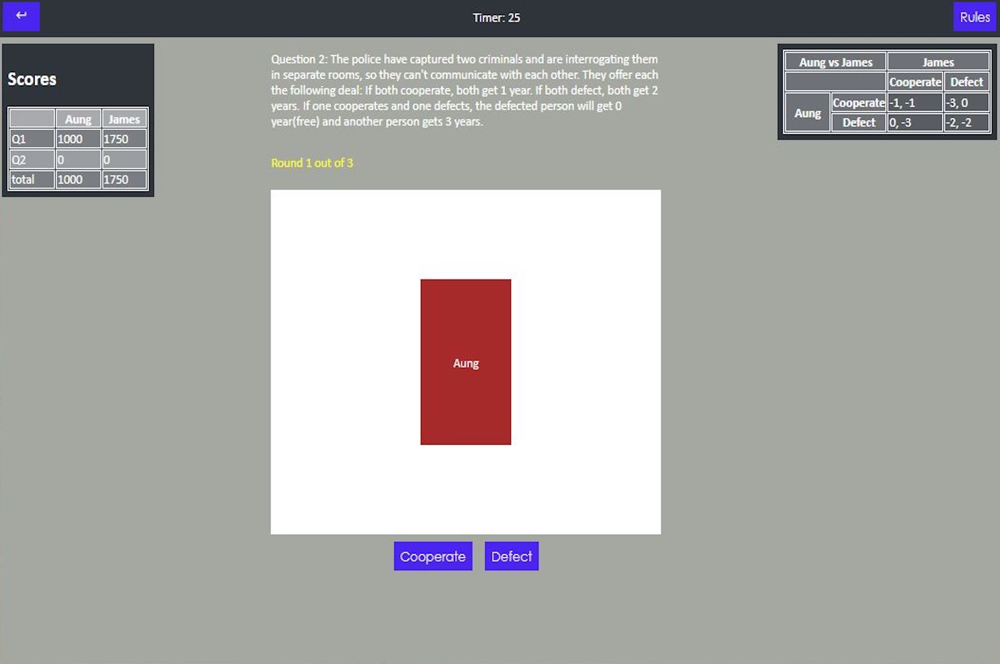

# Prisoner's Dilemma Game

## Flow

## Summary

    A two players card flipping game where each player can either cooperate or defect for each question.

## Why build it?

    After taking a psychology class, I am interested in the concept of Prisoner's Dilemma. It is a situation in which individuals would choose less optimal outcome due to tempting incentive for an individual even though the outcome is much better if they have cooperated.

    In that psychology class, the professor explains the concept with a little game where two groups try to compete against each other by choosing whether they would like to cooperate or decline to cooperate.

    That local game in a class inspires me to take to the next level: to implement the game online.

## Functionality

    There are two modes for the game: (1) the player with the most total score wins and (2) both players must have equal total scores.

    One player will enter the username and will wait for another player. After two players have entered their username, the game starts with a first question.

    A timer is also added so that players do not wait so long for another player. If the player has not chosen the side when the time runs out, the random choice will be made.

    After both players have made their decisions, the cards will turn and reveal the choices.

    The scores are computed based on the choice and the rules for each question.

## Tech Stack
<ul>
    <li>HTML</li>
    <li>CSS</li>
    <li>NodeJS</li>
    <li>SocketIO</li>
</ul>

